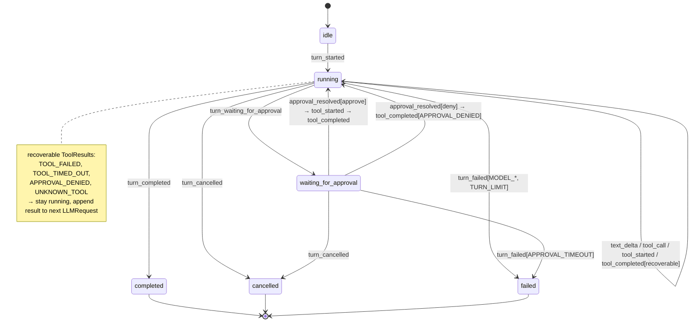

# Phase 1 — One Turn reducer in `shared` with sequence-numbered events

**Pair:** #3 (Turn reducer + seq) + #6 (scripted fake provider) — Phase 1 of 4
**Focus for this phase:** TurnState, legal transitions, failure mapping (your points 1 and 4). Points 2,3,6 deferred to Phase 2; point 5 to Phase 3.
**Status:** Draft for review — stops and waits for your go before Phase 2.

---

## 1. Current design (from plan)

**Files:** `packages/shared/src/index.ts` (StreamEvent, TurnStatus), `agent/loop.ts` (TurnRunner.run → TurnResult + emit), `agent/turn-manager.ts` (snapshot.status, events[], subscribe), `web/src/turn-state.ts` (applyEvent)

**What exists:**
- `TurnStatus = running | waiting_for_approval | completed | cancelled | failed` — defined but appears in **no event**. Status derived in 3 places:
  - loop: decides which terminal event to emit AND returns `TurnResult.status`
  - manager: `TurnSnapshot.status` — unspecified how derived
  - web: `applyEvent` reducer — plus "duplicate terminal-event protection" patch
- `StreamEvent` = 7 variants, no `seq`, no `text_delta` (but fake provider emits `text_delta`), no `callId` correlation between `tool_started` and `tool_completed`
- `TurnResult { status, usage?, message? }` duplicates terminal event + usage
- `turn_failed.code: TurnFailureCode | ToolErrorCode` mixes layers; `CANCELLED` is both a ToolErrorCode and a `turn_cancelled` event
- `snapshot()` + `subscribe()` are two non-atomic calls → replay gap (report C3)

**Consequence:** The interface cannot express "what is the current status?" without re-deriving it. The test surface is the event list, but the event list has no ordering guarantee.

---

## 2. Proposed TurnState (authoritative)

### 2.1 Event envelope (all events)

Every event that leaves the server has:

```ts
interface TurnEventBase {
  seq: number;        // per-turn, monotonic, starts at 1, assigned by TurnManager
  at: number;         // Date.now() or injected clock
  sessionId: SessionId;
  turnId: TurnId;
}
```

`seq` is **owned by TurnManager**, not by TurnRunner. Runner calls `manager.append(eventWithoutSeq)` → manager stamps `seq` + `at`, folds, persists (if any), notifies.

### 2.2 Event variants (new)

```ts
type StreamEvent = TurnEventBase & (
  | { type: "turn_started"; limits: TurnLimits; message: string } // message that started turn
  | { type: "text_delta"; delta: string; accumulated?: string }   // was missing in plan, needed for UI
  | { type: "tool_call"; callId: string; toolName: string; input: unknown } // model requested tool
  | { type: "turn_waiting_for_approval"; request: ApprovalRequest } // ApprovalRequest now includes sessionId + seq
  | { type: "approval_resolved"; requestId: ApprovalId; decision: ApprovalDecision; resolvedAt: number } // NEW: explicit, for replay
  | { type: "tool_started"; callId: string; toolName: string }
  | { type: "tool_completed"; callId: string; toolName: string; result: ToolResult }
  | { type: "turn_completed"; usage?: TurnUsage }
  | { type: "turn_cancelled"; reason: string }
  | { type: "turn_failed"; code: TurnFailureCode; message: string; retryable: boolean }
);
```

Key changes vs plan:
- `seq` on every event
- `text_delta` added (plan's fake already emits it)
- `tool_call` explicit (currently implicit in model response)
- `approval_resolved` explicit — today approval resolution is invisible in event log; UI clears approval only because `tool_completed` happens. For replay after reconnect, we need to know approval was decided.
- `tool_started`/`tool_completed` carry `callId` to correlate
- `turn_failed.code` is **only** `TurnFailureCode` — ToolErrorCode stays inside `ToolResult`

### 2.3 TurnState (single source of truth, in shared)

```ts
interface TurnState {
  sessionId: SessionId;
  turnId: TurnId;
  status: TurnStatus | "idle"; // idle only before first event
  seq: number;                 // last applied seq, 0 = no events
  limits: TurnLimits;
  startedAt?: number;
  updatedAt: number;
  stepsCompleted: number;      // model calls done
  pendingApprovals: Map<ApprovalId, ApprovalRequest>; // or array, but Map for lookup
  activeTools: Map<string, { toolName: string; startedAt: number }>; // callId → running tool
  error?: { code: TurnFailureCode; message: string; retryable: boolean };
  usage?: TurnUsage;
  isTerminal: boolean;
}

const initialTurnState: TurnState = {
  sessionId: "", turnId: "", status: "idle", seq: 0,
  limits: { maxSteps: 120, modelCallTimeoutMs: 120_000, toolTimeoutMs: 120_000, approvalTimeoutMs: 300_000 },
  updatedAt: 0, stepsCompleted: 0,
  pendingApprovals: new Map(), activeTools: new Map(),
  isTerminal: false,
};
```

Reducer signature (pure, in `@windows-runner/shared`):

```ts
export function reduceTurnState(state: TurnState, event: StreamEvent): TurnState;
```

No side effects, no I/O, deterministic — the **interface is the test surface**.

### 2.4 Legal transitions

```
idle
  └─(turn_started)→ running

running
  ├─(text_delta | tool_call | tool_started | tool_completed | approval_resolved)→ running
  │   Note: tool_completed with result.ok==false (TOOL_FAILED, TOOL_TIMED_OUT, APPROVAL_DENIED, UNKNOWN_TOOL)
  │         stays running — model will be called again with result appended
  ├─(turn_waiting_for_approval)→ waiting_for_approval
  ├─(turn_completed)→ completed [terminal]
  ├─(turn_cancelled)→ cancelled [terminal]
  └─(turn_failed)→ failed [terminal]

waiting_for_approval
  ├─(approval_resolved + tool_started)→ running   // approved → tool runs
  ├─(approval_resolved + tool_completed[APPROVAL_DENIED])→ running // denied → model recovers
  ├─(turn_cancelled)→ cancelled [terminal]
  └─(turn_failed[APPROVAL_TIMEOUT])→ failed [terminal]

completed | cancelled | failed [terminal]
  └─(any event)→ ignore if seq <= current seq, else log warning but state stays terminal
     // idempotency: duplicate terminal events are ignored, not error
```

State diagram (Mermaid):



**Invariants enforced by reducer:**
- `seq` must be `state.seq + 1` — otherwise ignore (duplicate) or throw in strict mode (gap = bug, should never happen if manager owns seq)
- Once `isTerminal`, no transition out — reducer returns same state (idempotent)
- `pendingApprovals` size is 0 or 1 in current sequential executor, but type allows many for future concurrent tools
- `stepsCompleted` increments on each `tool_call` or model turn? Define as model calls completed.

---

## 3. Failure mapping to terminal states (your point 4)

| Source | Condition | Event emitted | TurnState.status after | Terminal? | What happens to pending approvals / tools |
|--------|-----------|---------------|------------------------|-----------|-------------------------------------------|
| **Cancellation** | `AbortSignal` aborted (Stop pressed, session cancel, server shutdown) at any point | `turn_cancelled { reason }` | `cancelled` | Yes | Clear `pendingApprovals`, kill active tools via process-tree, abort provider signal |
| **Approval wait** | User approves | `approval_resolved { approve }` + `tool_started` + `tool_completed{ok:true}` | `running` | No | Remove from pending, run tool |
| **Approval wait** | User denies | `approval_resolved { deny }` + `tool_completed{ok:false, code: APPROVAL_DENIED}` | `running` | No | Remove from pending, append denial result to next LLMRequest so model can correct |
| **Approval wait** | Timeout (approvalTimeoutMs) | `turn_failed { code: APPROVAL_TIMEOUT }` | `failed` | Yes | Clear pending |
| **Approval wait** | Cancel while waiting | `turn_cancelled` | `cancelled` | Yes | Clear pending |
| **Tool exec** | Success | `tool_completed{ok:true}` | `running` | No | Remove from activeTools, append result to next request |
| **Tool exec** | Throw / non-zero exit / validation fail | `tool_completed{ok:false, code: TOOL_FAILED}` | `running` | No | Same — model recovers (actionable message) |
| **Tool exec** | Timeout (toolTimeoutMs) | `tool_completed{ok:false, code: TOOL_TIMED_OUT}` | `running` | No | Kill process tree, model recovers — unless deadline module decides timeout is fatal (see #1) |
| **Tool exec** | Cancelled due to turn cancel | `turn_cancelled` (not tool_completed) | `cancelled` | Yes | Kill tree |
| **Model call** | Success with no tool_calls | `turn_completed { usage }` | `completed` | Yes | — |
| **Model call** | Success with tool_calls | `tool_call` events + continue | `running` | No | Increment stepsCompleted |
| **Model call** | Timeout (modelCallTimeoutMs) | `turn_failed { MODEL_TIMEOUT }` | `failed` | Yes | Abort provider signal |
| **Model call** | Provider error / malformed response | `turn_failed { MODEL_FAILED }` | `failed` | Yes | — |
| **Model call** | Partial text then failure (stream fails mid-way) | `text_delta`s already emitted + `turn_failed { MODEL_FAILED }` | `failed` | Yes | Must ensure retry does not duplicate visible text (P1-05) — handled by seq + accumulated text |
| **Loop** | maxSteps exceeded | `turn_failed { TURN_LIMIT }` | `failed` | Yes | — |
| **Loop** | Unknown tool name | `tool_completed{ok:false, code: UNKNOWN_TOOL}` | `running` | No | Append as result, model can correct |

**Key decision:** Tool failures are **recoverable** (stay `running`), model failures and approval timeouts are **terminal failed**, cancellation is **terminal cancelled**. This matches the plan's prose but makes it explicit in the reducer — today it's scattered across loop.ts catch blocks.

**Open question for #2 and #1:** Should `TOOL_TIMED_OUT` ever be terminal? Global Constraint says "terminated with their full process tree on timeout" — if tool ignores abort, we need deadline module (candidate #1) to abort-and-await. If tool still doesn't die after grace, then `turn_failed` might be appropriate. Propose: tool timeout stays recoverable, but deadline module ensures process tree is dead before emitting `tool_completed`.

---

## 4. Design-it-twice

### Option A — Shared reducer + manager-stamped seq (recommended, from report)

- **Interface:**
  ```ts
  // shared
  function reduceTurnState(state: TurnState, event: StreamEvent): TurnState

  // server
  class TurnManager {
    append(sessionId, turnId, eventWithoutSeq: Omit<StreamEvent, "seq"|"at"|"sessionId"|"turnId">): StreamEvent
    subscribe(sessionId, turnId, afterSeq: number, listener): Unsubscribe // atomic replay-then-live
    snapshot(sessionId, turnId): TurnState // folds via reducer, not separate status field
  }
  ```
- **Flow:** Runner → `manager.append({type:"tool_started", ...})` → manager assigns seq, at, folds, notifies, persists (future)
- **Pros:** One place guarantees monotonic seq, no gaps, atomic replay-then-subscribe, restart recovery can re-derive state from log, UI and server share same reducer, Last-Event-ID trivial
- **Cons:** Runner must go through manager to emit (one extra hop), manager has more responsibility
- **Test seam:** `reduceTurnState` pure — 100% unit testable without I/O

### Option B — Loop owns seq, manager is passive store

- **Interface:**
  ```ts
  class TurnRunner {
    run(input): { events: AsyncIterable<StreamEvent> } // events already have seq
  }
  class TurnManager {
    store(event: StreamEvent): void
    replay(turnId, afterSeq): StreamEvent[]
  }
  ```
- **Flow:** Runner maintains `seq` counter, emits `seq: ++seq`. Manager just stores.
- **Pros:** Fewer dependencies, runner is self-contained, simpler manager
- **Cons:** Seq gaps if runner crashes mid-emit, duplicate seq if two runners for same turn (should never happen but not prevented structurally), replay race still needs lock, restart recovery must trust runner's seq, harder to enforce idempotency, Last-Event-ID still works but manager cannot guarantee no gaps
- **Deletion test:** Deleting manager's seq logic moves complexity into runner, which already has many concerns (provider, tools, approvals)

**Recommendation:** Option A. It concentrates the ordering invariant in one module (manager) and makes the reducer the single test surface. The extra hop is worth it — it's the same pattern as event sourcing.

---

## 5. What this phase does NOT cover (deferred)

- **Persistence:** Phase 2 will decide if events are only in-memory (current plan) or append-only log with two adapters (memory + file). For Phase 1, `TurnManager` keeps `Map<turnId, { state, events[] }>` in memory, but API already returns `TurnState` via reducer.
- **Sequence ownership after restart:** Phase 2. If persisted, seq continues from last persisted; if in-memory, restart = all turns gone → need terminal event on boot (candidate 7).
- **Last-Event-ID:** Phase 2. With seq, it's trivial: SSE `id:` = seq, client sends `Last-Event-ID`, server calls `subscribe(afterSeq)`. Decision: implement now (cheap) vs defer.
- **Scripted fake provider:** Phase 3. Will need to record `LLMRequest[]` and be scripted per step: `step1: req => [tool_call], step2: req => assert req contains tool result, then [text]`.

---

## 6. Benefits and risks

**Benefits:**
- Locality: one state machine, one file, one test suite
- Leverage: seq closes replay race, enables Last-Event-ID, idempotency, and future persistence seam
- Deletion test: deleting `web/turn-state.ts` and manager's private status logic concentrates lifecycle in shared — yes, signal
- Tests: `shared/test/turn-reducer.test.ts` becomes authoritative; manager and UI tests become integration

**Risks:**
- Migration: plan's `TurnResult` and `TurnSnapshot.status` must be changed — but plan is not yet implemented, so cheap now, expensive later
- `text_delta` and `approval_resolved` are new events — need to update fake provider and loop tests, but they already assume text_delta exists

---

## 7. Next steps (awaiting your go)

**Phase 2:** Sequence ownership, replay semantics, Last-Event-ID, persistence model (in-memory vs file-backed log), atomic subscribe
**Phase 3:** Scripted fake provider design + multi-step test with request recording
**Phase 4:** Integration sketch, CONTEXT.md seeding, ADR for rejected alternative, migration plan for existing plan tasks

Please confirm go for Phase 2, or request changes to Phase 1.

