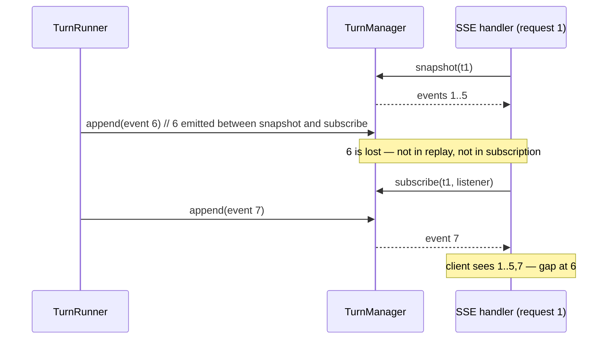

# Phase 2 — Sequence ownership, replay, persistence, Last-Event-ID

**Pair:** #3 + #6 — Phase 2 of 4
**Focus:** Your points 2, 3, 6 — whether events are persisted/replayable/in-memory, sequence ownership after reconnects/restarts, Last-Event-ID now vs deferred.
**Depends on:** Phase 1 (TurnState, reducer, envelope with `seq`)
**Status:** Draft for review — stops and waits for your go before Phase 3.

---

## 1. Current design (from plan)

**From Task 7 (turn-manager.ts, routes.ts):**
- `TurnManager.start` creates AbortController, starts `TurnRunner.run` without awaiting, **stores every event in order** in memory
- `snapshot(turnId)` returns `{ events[], pendingApprovals[], status }`
- `subscribe(turnId, listener)` returns unsubscribe, never cancels turn on listener disconnect
- SSE handler: **"writes the replay before subscribing"** (l.781) — two non-atomic calls:
  ```ts
  const snap = manager.snapshot(turnId); // call 1
  res.write(snap.events);                // emit gap
  const unsub = manager.subscribe(turnId, listener); // call 2
  ```
  Any event emitted between call 1 and 2 is lost. Any event emitted during `res.write` can be duplicated.
- UI: "apply replayed events idempotently" + "duplicate terminal-event protection" (l.873) — patches downstream for a hole in the contract
- No `seq` on StreamEvent, so SSE `id:` cannot be set, `Last-Event-ID` cannot be honored — every reconnect replays entire history
- No persistence: restart = all turns gone, no terminal event, UI reconnects forever (l.866: "reconnect while running or waiting_for_approval")
- README product stores transcripts under `WINDOWS_RUNNER_DATA_DIR`, but plan's event history is second, disconnected store

**Test:** `routes-turns.test.ts` "approval remains pending after SSE disconnect and is replayed on reconnect" — cancels first fetch body, then second fetch expects `turn_waiting_for_approval` in text. It proves disconnect doesn't cancel, but does NOT prove atomic replay (no concurrent emit during replay).

---

## 2. Sequence ownership

### 2.1 Who owns seq?

**Decision: TurnManager owns seq, per turn, monotonic from 1.**

- Runner does NOT assign seq. Runner calls `manager.append(turnId, eventWithoutSeq)` → manager stamps `seq = ++counter`, `at = now()`, folds via `reduceTurnState`, notifies, persists (if store present)
- Why manager, not runner?
  - Single writer per turn → no gaps, no duplicates, no races
  - Manager is the only module that sees both replay and live subscribers — it can guarantee atomic replay-then-subscribe
  - Restart recovery: manager can re-derive counter from log length (if persisted)
  - Deletion test: moving seq logic into runner concentrates too many concerns (provider, tools, approvals, ordering)

**Counter implementation:**
```ts
class TurnLog {
  private seqCounter = 0;
  private events: StreamEvent[] = [];
  private state: TurnState = initialTurnState;

  append(eventWithoutSeq: Omit<StreamEvent, "seq"|"at"> & { at?: number }): StreamEvent {
    this.seqCounter++;
    const sequenced = { ...eventWithoutSeq, seq: this.seqCounter, at: eventWithoutSeq.at ?? Date.now() } as StreamEvent;
    // idempotency: if event with same seq already exists (retry), ignore
    // gap check: seq must be exactly previous+1
    this.events.push(sequenced);
    this.state = reduceTurnState(this.state, sequenced);
    return sequenced;
  }
}
```

If persisted, `seqCounter` initialized from last persisted seq on boot.

### 2.2 Idempotency and gap handling

- `seq <= state.seq` → duplicate, ignore (reducer returns same state, no notify)
- `seq == state.seq + 1` → normal, apply
- `seq > state.seq + 1` → gap, bug, should never happen if manager is single writer. Log error, but do NOT apply — gap means lost events, state is inconsistent. In strict mode, throw; in prod, emit `turn_failed` with code `TURN_LIMIT`? Better: treat as `turn_failed` with `message: "event log gap"`. This case only possible if store is corrupted or two writers.

This makes "duplicate terminal-event protection" in UI unnecessary — it's a property of the stream.

---

## 3. Replay semantics — fixing the race

### 3.1 Before (non-atomic)



### 3.2 After (atomic subscribe)

```ts
interface TurnManager {
  // atomic: replay then attach, under one lock per turn
  subscribe(sessionId: SessionId, turnId: TurnId, afterSeq: number, listener: (event: StreamEvent) => void): {
    replay: StreamEvent[], // events with seq > afterSeq
    unsubscribe: () => void,
    state: TurnState,      // current state after replay
  }
}
```

Implementation (Node.js single-threaded, but async — need per-turn queue):

```ts
class TurnManager {
  private logs = new Map<TurnId, TurnLog>();
  private listeners = new Map<TurnId, Set<Listener>>();

  subscribe(turnId, afterSeq, listener) {
    const log = this.logs.get(turnId);
    if (!log) throw NotFound;

    // Critical section: synchronous, no await inside
    const replay = log.events.filter(e => e.seq > afterSeq);
    let set = this.listeners.get(turnId);
    if (!set) { set = new Set(); this.listeners.set(turnId, set); }
    set.add(listener);

    return {
      replay,
      state: log.state,
      unsubscribe: () => set!.delete(listener),
    };
  }

  append(turnId, eventWithoutSeq) {
    const log = this.logs.get(turnId)!;
    const sequenced = log.append(eventWithoutSeq);
    // notify outside critical section but synchronously
    this.listeners.get(turnId)?.forEach(l => l(sequenced));
    // persist async, but don't block notify
    this.store?.append(turnId, sequenced).catch(console.error);
    return sequenced;
  }
}
```

**SSE handler now:**

```ts
app.get("/api/sessions/:s/turns/:t/events", (req, res) => {
  const afterSeq = parseInt(req.headers["last-event-id"] as string) || 0;
  const { replay, unsubscribe, state } = manager.subscribe(sessionId, turnId, afterSeq, (event) => {
    res.write(`id: ${event.seq}\ndata: ${JSON.stringify(event)}\n\n`);
  });

  // write replay with ids
  for (const event of replay) {
    res.write(`id: ${event.seq}\ndata: ${JSON.stringify(event)}\n\n`);
  }

  // if terminal, close immediately after replay
  if (state.isTerminal) {
    res.end();
    unsubscribe();
    return;
  }

  req.on("close", () => {
    unsubscribe(); // does NOT cancel turn, only removes listener
  });
});
```

**Result:**
- No gap: replay and subscribe are one atomic operation
- No duplicate: seq makes idempotency explicit, UI can ignore `seq <= lastSeen`
- No "apply replayed events idempotently" patch needed — it's a property of `seq`

---

## 4. Persistence — in-memory now, seam for file later

### 4.1 Two options

**Option A (recommended for this slice): In-memory only, but with `TurnLogStore` seam**

- `TurnManager` keeps `Map<turnId, TurnLog>` in memory
- Define store interface now, but only implement `InMemoryTurnLogStore` (which is just the Map)
- File adapter deferred to when transcripts are needed (candidate 7)
- Restart = all turns gone → `GET /events` returns 404, UI treats 404 as `failed` with `code: RESTART` or shows "turn not found, was server restarted?"

Pros: matches plan's scope, minimal, no file I/O in reliability slice
Cons: restart loses work — but plan already has this limitation, and README's crash recorder will need file anyway

**Option B: File-backed log now (JSONL per turn under `WINDOWS_RUNNER_DATA_DIR`)**

- Each turn: `data/turns/{turnId}.jsonl` — one JSON per line, each line is a StreamEvent with seq
- On boot, manager scans dir, loads each file, re-derives state via reducer, if state is not terminal, appends `turn_failed { code: "RESTART", message: "server restarted" }`
- Seq continues from last line

Pros: resumability across restart, one log serves SSE replay, transcript, crash recorder
Cons: beyond plan's scope, needs file locking, cleanup policy (when to delete old turns?), more code in reliability slice

### 4.2 Recommended: Option A with seam, Option B as follow-up

Define seam now:

```ts
interface TurnLogStore {
  // append is idempotent on seq
  append(turnId: TurnId, event: StreamEvent): Promise<void>;
  read(turnId: TurnId, afterSeq: number): Promise<StreamEvent[]>;
  readAll(turnId: TurnId): Promise<StreamEvent[]>;
  list(): Promise<TurnId[]>; // for boot scan
  // optional: delete old turns
}

class InMemoryTurnLogStore implements TurnLogStore {
  private logs = new Map<TurnId, StreamEvent[]>();
  async append(turnId, event) {
    let arr = this.logs.get(turnId);
    if (!arr) { arr = []; this.logs.set(turnId, arr); }
    // idempotent: ignore if seq already present
    if (arr.some(e => e.seq === event.seq)) return;
    arr.push(event);
  }
  async read(turnId, afterSeq) {
    return (this.logs.get(turnId) ?? []).filter(e => e.seq > afterSeq);
  }
  async readAll(turnId) { return this.logs.get(turnId) ?? []; }
  async list() { return [...this.logs.keys()]; }
}

class FileTurnLogStore implements TurnLogStore {
  // JSONL per turn, fsync on append, etc — deferred
}
```

Manager depends on store interface, not concrete:

```ts
class TurnManager {
  constructor(deps: { provider, tools, approvals, store?: TurnLogStore, now?: () => number }) {
    this.store = deps.store ?? new InMemoryTurnLogStore();
  }

  async boot() {
    // if file store, scan and re-derive
    for (const turnId of await this.store.list()) {
      const events = await this.store.readAll(turnId);
      let state = initialTurnState;
      for (const e of events) state = reduceTurnState(state, e);
      this.logs.set(turnId, { events, state, seqCounter: events.length });
      if (!state.isTerminal) {
        // append restart failure
        this.append(turnId, { type: "turn_failed", code: "RESTART" as any, message: "server restarted", retryable: false, sessionId: state.sessionId, turnId });
      }
    }
  }
}
```

**For this slice:** Use `InMemoryTurnLogStore`, no boot scan. For candidate 7 (follow-up), implement `FileTurnLogStore`.

### 4.3 What survives what?

| Scenario | In-memory (now) | File (future) |
|----------|----------------|---------------|
| SSE disconnect | Pending approval survives, replay on reconnect via `afterSeq` | Same |
| Server restart | All turns lost, 404 | Non-terminal turns get `turn_failed RESTART` appended, replayable |
| Process crash | Same as restart | Same as restart |
| Old turns | Kept in memory until evicted (need policy: LRU or TTL) | Kept on disk until GC (e.g., 7 days) |

**Eviction policy (needed even for in-memory):** Plan says "stores every event in order" but not when to delete. Propose: keep all events for active turns, keep last 100 turns in memory, evict older on new turn start. For file, GC after 7 days or on session delete.

---

## 5. Last-Event-ID — support now, not deferred

### 5.1 Why now?

- With `seq`, it's 3 lines: parse header, pass to `subscribe`, write `id:`
- Without it, every reconnect replays entire history (wasteful, and UI must dedup)
- SSE spec already defines `Last-Event-ID` — browsers send it automatically on reconnect if `id:` was set
- If we defer, we have to change SSE handler and manager API later, and UI must keep its own "last seen seq" — which is exactly what Last-Event-ID is

### 5.2 Implementation

**Server:**
- On each SSE write: `id: ${event.seq}\n`
- On request: `afterSeq = parseInt(req.headers["last-event-id"] as string) || parseInt(req.query.afterSeq as string) || 0`
- Support both header and query param `?afterSeq=` for `fetch` clients (EventSource sends header, fetch must send query)

**Client (web):**
- `EventSource` automatically handles `Last-Event-ID` if server sends `id:`
- For `fetch` streaming (if used), store `lastSeq` and append `?afterSeq=${lastSeq}` on reconnect

**Test:**
```ts
test("reconnect with Last-Event-ID replays only missed events", async () => {
  const manager = new TurnManager({ provider, tools, approvals, store: new InMemoryTurnLogStore() });
  // start turn, emit 1..5
  const sub1 = manager.subscribe("s1", "t1", 0, () => {});
  assert.equal(sub1.replay.length, 5);
  // simulate disconnect after 3
  manager.append("t1", { type: "text_delta", delta: "6" });
  const sub2 = manager.subscribe("s1", "t1", 3, () => {});
  assert.deepEqual(sub2.replay.map(e => e.seq), [4,5,6]);
});
```

**Decision: Support now.** Cost is negligible, benefit is correctness and efficiency.

---

## 6. Behavior after reconnects and restarts (your point 3)

### 6.1 Reconnects (SSE)

- Client disconnects (network blip, tab background, server closes)
- Client reconnects with `Last-Event-ID: <lastSeenSeq>`
- Server: `subscribe(afterSeq=lastSeenSeq)` → atomic replay of `seq > afterSeq` + live
- If turn is terminal, server replays remaining events then closes stream (client sees terminal and stops reconnecting)
- If turn is still running/waiting, stream stays open

**UI logic (from plan, improved):**
```ts
let lastSeq = 0;
function connect() {
  const es = new EventSource(`/api/sessions/${sessionId}/turns/${turnId}/events`, { withCredentials: true });
  // EventSource sends Last-Event-ID automatically
  es.onmessage = (e) => {
    const event = JSON.parse(e.data) as StreamEvent;
    lastSeq = event.seq; // or parseInt(e.lastEventId)
    state = reduceTurnState(state, event);
    render(state);
    if (state.isTerminal) es.close();
  };
  es.onerror = () => {
    if (state.isTerminal) es.close();
    else setTimeout(connect, 1000); // reconnect while running/waiting
  };
}
```

No need for "apply replayed events idempotently" — reducer already ignores `seq <= state.seq`.

### 6.2 Restarts (process)

**In-memory (now):**
- All `TurnLog`s gone
- `GET /turns/:t/events` → 404
- UI: on 404, transition to `failed` with `code: RESTART` or "turn not found"
- Pending approvals gone — user must start new turn

**File-backed (future):**
- On boot, `manager.boot()` scans store, re-derives state, appends `turn_failed RESTART` for non-terminal turns
- `GET /events` replays full log including restart failure
- UI sees failure, can offer retry

**For this slice, document:** "Restart loses active turns — this is known limitation, will be fixed by file store (candidate 7). UI should treat 404 as terminal."

---

## 7. Design-it-twice for persistence

### Option A: Store is append-only log, manager folds (recommended)

- Store: `append(turnId, event)`, `read(turnId, afterSeq)`, `list()`
- Manager: owns `TurnLog` (events + state), calls store on append, re-derives on boot
- Pros: Store is dumb, manager is smart, easy to test, file adapter is just JSONL
- Cons: Manager must keep events in memory for fast replay (but can also read from store if needed)

### Option B: Store is state + events, manager is thin

- Store: `saveState(turnId, state)`, `appendEvent(turnId, event)`, `load(turnId) => {state, events}`
- Manager: delegates to store for everything

Pros: Store could be DB with transactions
Cons: Store interface bigger, harder to make file adapter atomic, two sources of truth (state and events) can drift

**Recommendation:** Option A — store is log, manager is materialized view via reducer. Event sourcing 101.

---

## 8. Benefits and risks

**Benefits:**
- Locality: ordering, replay, persistence behind one seam
- Leverage: seq fixes replay race, enables Last-Event-ID, idempotency, future file store, transcript, crash recorder
- Tests: replay race now testable (concurrent append during subscribe), Last-Event-ID testable, restart testable via InMemory store + boot

**Risks:**
- In-memory eviction policy needed — without it, memory grows unbounded
- File store needs fsync and locking — deferred, but seam must support it
- `Last-Event-ID` header is only sent by EventSource, not fetch — need query param fallback

---

## 9. Open questions for Phase 3

- How does scripted fake provider record `LLMRequest[]` and script per step? (Phase 3)
- Should `text_delta` have `accumulated` field for P1-05 "partial-stream retries don't duplicate visible text"?
- Should `turn_failed` with `RESTART` be a new `TurnFailureCode`?

---

## 10. Next steps

**Phase 3:** Scripted fake provider — record requests, script per step, failure modes (fail after partial text, ignores abort, malformed input, unknown tool), multi-step test with exact requests sent.

Please confirm go for Phase 3, or request changes to Phase 2.

