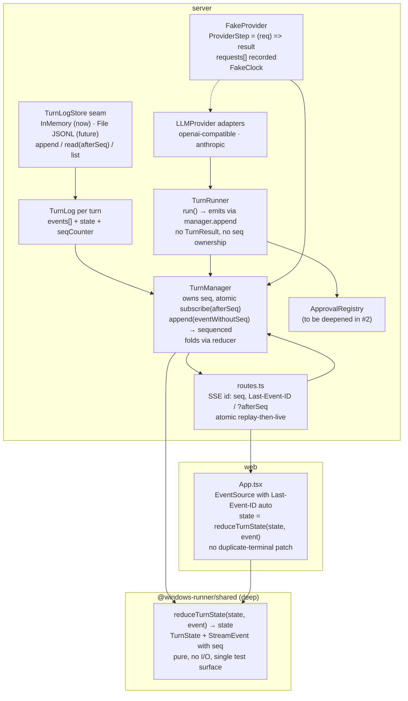

# Phase 4 — Integration, migration, follow-up order

**Pair:** #3 + #6 — Phase 4 of 4 (final)
**Status:** Complete — awaiting your review.

---

## 1. Integrated architecture (after #3 + #6)

**Flow for one turn:**

1. `POST /turns` → `manager.start(sessionId, message)` → creates `TurnLog` with `seq=0`, `state=idle`, calls `loop.run()`
2. Loop: `manager.append({type:"turn_started", limits, message})` → manager stamps `seq=1`, `at=now()`, folds `idle→running`, notifies, stores
3. Loop calls `provider.stream(request, {signal})` → fake records `requests[0]`, returns step1 chunks (e.g., `tool_call c1`)
4. Loop: `manager.append({type:"tool_call", callId, toolName})` → seq=2, state stays running
5. Loop: approval? If requiresApproval → `manager.append({type:"turn_waiting_for_approval", request})` → seq=3, state=`waiting_for_approval`
6. SSE: client `subscribe(afterSeq=0)` → atomic replay 1..3 + live, writes `id: 1`, `id: 2`, `id: 3`
7. User approves → `approval_resolved` → seq=4 → `tool_started` seq=5 → `tool_completed` seq=6 (ok or TOOL_FAILED) → state back to `running`
8. Loop appends tool result to next `LLMRequest.messages` as `role:"tool"` and calls `provider.stream(request2)` → fake step2 asserts `request2` contains tool result, returns `text_delta`
9. Loop: `manager.append({type:"text_delta"})` seq=7 → `turn_completed` seq=8 → state `completed`, `isTerminal=true`
10. SSE handler sees terminal, replays remaining, closes. UI stops reconnecting.

**Reconnect:** Network blip after seq 5, client reconnects with `Last-Event-ID: 5` → `subscribe(afterSeq=5)` → replay 6..8, no gap, no duplicate (reducer ignores `seq <= state.seq`).

**Restart (memory now):** All logs gone, `GET /events` 404 → UI shows "turn not found, server restarted". (Future file: `boot()` scans, re-derives, appends `turn_failed RESTART` for non-terminal.)

---

## 2. Migration plan for existing plan tasks

| Plan Task | Current | After #3+#6 | Migration |
|-----------|---------|-------------|-----------|
| **Task 1 shared** | `StreamEvent` 7 variants, no seq, no text_delta, `turn_failed.code: TurnFailureCode\|ToolErrorCode`, `TurnStatus` defined but not in events | Envelope with seq/at, 10 variants incl text_delta, tool_call, approval_resolved, callId correlation, `turn_failed.code` only TurnFailureCode | Update `shared/src/index.ts`, add `reduceTurnState`, `TurnState`, `TurnLogStore` interface, `initialTurnState`. Add `shared/test/turn-reducer.test.ts` with legal transitions, idempotency, terminal, seq gap. |
| **Task 4 provider** | `FakeProvider(chunks[], {waitForAbort})`, no requests[] | `FakeProvider(steps: ProviderStep[], {clock})`, `requests[]`, `lastSignals[]`, helpers | Rewrite `fakes/fake-provider.ts`, add `FakeClock`, add `Steps` helpers, add unit test for fake itself. |
| **Task 6 loop** | `TurnRunner.run() → TurnResult`, `emit(event)`, `TurnResult.status` duplicates terminal, unknown tool as non-throwing result but code is TurnFailureCode | `run()` emits via `manager.append()`, no TurnResult return (or return void + completion promise from manager), `ToolResult` sole minter in executor, unknown tool → `tool_completed UNKNOWN_TOOL` staying running | Change `TurnRunnerDependencies` to take `manager` not `emit`, remove `TurnResult`, update `loop.test.ts` to use step-scripted fake + assert `requests[]`. |
| **Task 7 manager** | `snapshot()` + `subscribe()` non-atomic, stores events in memory, status derived unspecified | `subscribe(afterSeq)` atomic, `append()` stamps seq, `snapshot()` folds via reducer, `TurnLogStore` seam, SSE `id: seq` + Last-Event-ID | Rewrite `turn-manager.ts`, `turn-log-store.ts`, update `routes.ts` SSE handler, update `routes-turns.test.ts` with replay race test, Last-Event-ID test, 404 handling. |
| **Task 8 web** | `applyEvent` re-derives status, duplicate-terminal protection | `applyEvent = reduceTurnState` import, no patch, `lastSeq` tracked, EventSource auto Last-Event-ID | Delete `turn-state.ts` logic, import from shared, update `turn-state.test.ts` to use reducer + seq, add reconnect test. |
| **Task 9 integration** | 4 cases asserting event type lists only | Same 4 cases but asserting `provider.requests[]` contains tool results, plus partial-then-fail, ignore-abort, unknown-tool | Update `reliability.integration.test.ts` to use new fake, assert requests. |

**Order to implement (within #3+#6 slice):**
1. Shared: envelope + reducer + TurnState + TurnLogStore interface + tests
2. Fake: new FakeProvider + FakeClock + helpers + unit test
3. Manager: TurnLog + atomic subscribe + InMemory store + SSE id + Last-Event-ID + tests
4. Loop: emit via manager.append, remove TurnResult, use ToolResult minter
5. Routes: SSE handler uses subscribe(afterSeq), 404 handling
6. Web: import reducer, remove duplicate-terminal patch, EventSource with Last-Event-ID
7. Integration: update 4 cases to assert requests[]

---

## 3. Follow-up order (as you specified)

**After #3+#6, recommended:**

1. **#2 approval invariants** — small, sharp, prose invariants become structural. Make ApprovalRegistry own identity (minted, namespaced by turn), expiry (single source), settlement (only user decision, expiry, cancelTurn). Add `sessionId` to `ApprovalRequest`. Remove signal from wait. Tests: concurrent turns with same call id, decision after expiry 409, disconnect does not cancel.

2. **#1 unified deadline** — fold `cancellation.ts` + `timeout.ts` into `deadline.ts`, abort-and-await not race, kind-tagged error (model|tool|approval) at point of failure. `CancellationToken` deleted, `AbortSignal` is interface. Tests: fake tool that resolves after abort, assert executor does not return before it.

3. **#5 Tool contract / filesystem safety** — deepen `ToolDefinition` to `{ name, description, inputSchema, requiresApproval, reason, execute(parsedInput) }`, executor sole minter of `ToolResult` (including unknown, malformed, denied), model tool list derived from registry. Fix `safePath` bugs: `..` escapes root, `src/a.ts` with missing parent throws ENOENT not actionable. Add table-driven tests.

4. **#4 minimum ProjectRoot** — reify `ProjectRoot` value: validated against `allowedProjectRoots`, `resolve(requested)` = safePath, canonical dir. `POST /turns` stops accepting `cwd`, session owns root and concurrency policy (at most one active turn). History seeding deferred.

5. **#7 event log persistence** — implement `FileTurnLogStore` JSONL per turn, `manager.boot()` scans and appends `turn_failed RESTART` for non-terminal, GC policy, transcript + crash recorder use same log. Only if transcripts in next slice.

---

## 4. Open questions resolved

| Question from Phase 1-3 | Resolution |
|-------------------------|------------|
| Complete TurnState and legal transitions? | Phase 1 doc: state machine, invariants, terminal handling |
| Events persisted, replayable, or in-memory? | Phase 2: in-memory now with `TurnLogStore` seam, file deferred, eviction LRU 100 turns |
| Sequence ownership after reconnects/restarts? | Manager owns seq, atomic subscribe, Last-Event-ID now, restart = 404 now, `turn_failed RESTART` future |
| Cancellation, approval, tool, provider failures → terminal? | Phase 1 table: tool failures recoverable (running), model/approval timeout/turn limit terminal failed, cancel terminal cancelled |
| Scripted provider test for 2 steps with exact requests? | Phase 3: step function asserts on request, `requests[]` proves append |
| Last-Event-ID now or deferred? | Now — 3 lines, cheap, correct, browsers auto-send |

---

## 5. Risks and mitigations

- **Migration touches many files:** But plan not yet implemented, so cheap now. Do shared first, then fake, then manager, then loop — each step has tests.
- **Fake complexity:** Test the fake itself with simple "records requests" unit test.
- **Request shape (where tool results go):** Propose `role:"tool"` messages — standard OpenAI/Anthropic, already used in many agents. If different, change one place (LLMRequest type).
- **Eviction policy:** In-memory store needs LRU, otherwise memory leak. Implement simple Map with max 100 turns, delete oldest on new turn.
- **File store future:** Needs fsync, locking — deferred, but seam must support async append.

---

## 6. Deliverables for this exploration

- `CONTEXT.md` — domain vocabulary, invariants, follow-up order
- `docs/adr/001-turn-reducer-seq-and-scripted-provider.md` — decision + rejected alternatives
- `docs/architecture/exploration-3-6/phase-1-turn-state-machine.md`
- `docs/architecture/exploration-3-6/phase-2-sequence-replay-persistence.md`
- `docs/architecture/exploration-3-6/phase-3-scripted-fake-provider.md`
- `docs/architecture/exploration-3-6/phase-4-integration.md` (this file)
- HTML report (previous): `/tmp/architecture-review/architecture-review-20260919-192148.html`

All strengths capped at Worth exploring / Speculative as agreed — these are predicted frictions, not observed.

---

## 7. Next action

Awaiting your go for implementation of #3+#6, or for moving to #2 approval invariants. If you want to start coding, recommended first PR: shared envelope + reducer + TurnLogStore seam + new FakeProvider + FakeClock (Tasks 1 and 4 of plan, but with new interfaces).

